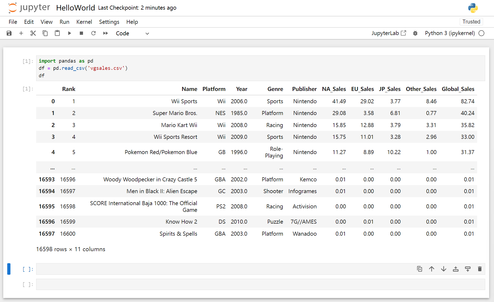

# Machine learning in action

`jupyter notebook` 使用 | [音乐商店Demo](./README_music_store_demo.md)

## Steps

1. Import the Data
2. Clean the Data
3. Split the Data into Training/Test Sets
4. Create a Model
5. Train the Model
6. Make Predictions
7. Evaluate and Improve

## Libraries

- Numpy
- Pandas
- MatPlotLib
- Scikit-Learn

## 创建`conda`环境

```bash
conda create -n ml python=3.10.6
conda activate ml
```

> 注意：Mac环境以下命令中 `python` 替换为 `python3`

## 安装依赖

```bash
python -m pip install -r requirements.txt -i https://pypi.tuna.tsinghua.edu.cn/simple
```

> 更新依赖
> ```bash
> python -m pip install --upgrade --force-reinstall --no-cache-dir --no-warn-script-location -r requirements.txt -i https://pypi.tuna.tsinghua.edu.cn/simple
> ```

## Jupyter Notebook

### 启动 `jupyter notebook` 服务

```bash
jupyter notebook
```

### 访问 `jupyter notebook`

- 访问 [http://localhost:8888/tree](http://localhost:8888/tree)

### 下载数据集

- 访问 [kaggle.com | Video Game Sales](https://www.kaggle.com/datasets/gregorut/videogamesales)

### 在 `jupyter notebook` 中加载数据集

```python
import pandas as pd
df = pd.read_csv('vgsales.csv')
df
```

